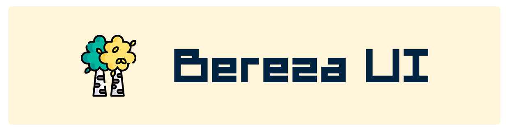

<p align="center">




<a href="https://jitpack.io/#RavenZIP/bereza-ui">
  
</a>
</p>

> 🌐 **Languages:**  
> [Русский](README.md) | [English](docs/README-EN.md)

## 🔎 Что такое Bereza UI?

Bereza UI — библиотека компонентов для Compose Multiplatform, расширяющая возможности Material Design. Она включает дополнительные UI-компоненты и инструменты, отсутствующие в стандартной библиотеке Material, а также предлагает альтернативные реализации некоторых существующих компонентов с более удобным API.

## 🌍 Поддерживаемые платформы

| Платформа | Статус              |
|-----------|---------------------|
| Windows   | ✅ Поддерживается    |
| Linux     | ❓ Неизвестно        |
| macOS     | ❓ Неизвестно        |
| Web       | ✅ Поддерживается    |
| Android   | ✅ Поддерживается    |
| iOS       | ❌ Не поддерживается |

macOS, iOS временно не поддерживаются, так как невозможно проверить работоспособность библиотеки на данных платформах.

## 🌳 Структура проекта

### - bereza-core
Основной модуль библиотеки. Содержит все базовые компоненты и их полный API на Compose.

### - bereza-extensions
Упрощённые обёртки над компонентами `bereza-core`. Вместо Compose-функций в качестве параметров используются обычные параметры (text, textStyle и др.), что делает API более лаконичным и удобным для большинства типовых сценариев.

### - bereza-reactive
Интеграция с [`kotlin-reactive-forms`](https://github.com/RavenZIP/kotlin-reactive-forms).
Позволяет использовать компоненты Bereza UI совместно с `FormControl` для построения сложных форм с валидацией и управлением состоянием.

### - berezaApp
Демонстрационное приложение библиотеки. Позволяет запустить Bereza UI, ознакомиться с доступными компонентами и протестировать их работу в реальных сценариях.

### - docs
Документация проекта.

### - images
Изображения, используемые в README и документации.

## 🚀 Установка

**settings.gradle.kts**

```
dependencyResolutionManagement {
    repositoriesMode.set(RepositoriesMode.FAIL_ON_PROJECT_REPOS)
    repositories {
        ...
        maven ("https://jitpack.io")
    }
}
```

**build.gradle.kts**

```
dependencies {
    implementation("com.github.RavenZIP.bereza-ui:bereza-core:$version") 
}
```

Если вы используете libs.versions.toml

**libs.versions.toml**

```
[versions]
ravenzip-bereza-ui = "$version"

[libraries]
ravenzip-bereza-ui-core = { module = "com.github.RavenZIP.bereza-ui:bereza-core", version.ref = "ravenzip-bereza-ui" }
```

**build.gradle.kts**

```
dependencies {
    implementation(libs.ravenzip.bereza.ui.core)
}
```

## 🤝 Интеграции
[kotlin-reactive-forms](https://github.com/RavenZIP/kotlin-reactive-forms)

## 🚬 Примеры использования

В разработке...
Смотрите berezaApp модуль

## 📚 Документация

В разработке...

## 📜 Лицензия

Эта библиотека распространяется по лицензии Apache 2.0. Подробности смотрите в файле [ЛИЦЕНЗИЯ](LICENSE).

## 👾 Разработчик

**Черных Александр**

- [Telegram](https://t.me/RavenZIP)
