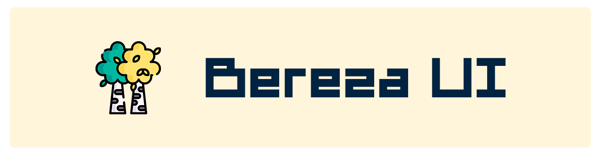

<p align="center">




<a href="https://jitpack.io/#RavenZIP/bereza-ui">
  
</a>
</p>

> 🌐 **Languages:**  
>  [English](README-EN.md) | [Русский](../README.md)

## 🔎 What is Bereza UI?

Coming soon...

## 🌍 Supported platforms

Coming soon...

## 🚀 Installation

**settings.gradle.kts**

```
dependencyResolutionManagement {
    repositoriesMode.set(RepositoriesMode.FAIL_ON_PROJECT_REPOS)
    repositories {
        ...
        maven ("https://jitpack.io")
    }
}
```

**build.gradle.kts**

```
dependencies {
    implementation("com.github.RavenZIP.bereza-ui:bereza-core:$version") 
}
```

If you are using libs.versions.toml

**libs.versions.toml**

```
[versions]
ravenzip-bereza-ui = "$version"

[libraries]
ravenzip-bereza-ui-core = { module = "com.github.RavenZIP.bereza-ui:bereza-core", version.ref = "ravenzip-bereza-ui" }
```

**build.gradle.kts**

```
dependencies {
    implementation(libs.ravenzip.bereza.ui.core)
}
```

## 🚬 Using

Coming Soon...

## 📜 License

This library is licensed under the Apache 2.0 License. See the [LICENSE](../LICENSE) file for details.

## 👾 Developer

**Alexander Chernykh**

- [Telegram](https://t.me/RavenZIP)